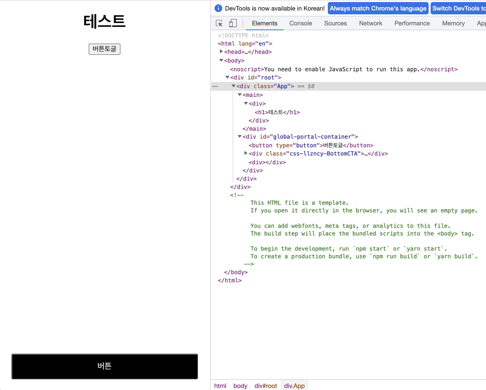
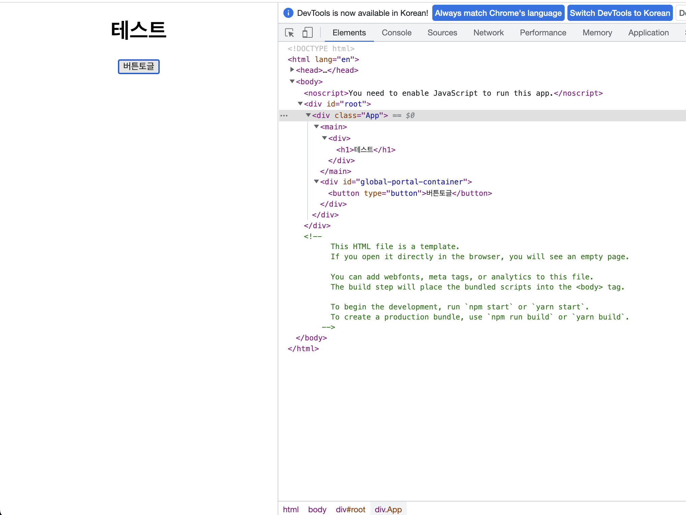

# React Portal (포털)

## 포털이란
> Portals provide a first-class way to render children into a DOM node that exists outside the DOM hierarchy of the parent component.

포털은 모달이나 스낵바, 경고창, 이벤트 팝업 등을 표시할 때 유용한데 포털을 쓰지 않고 각 컴포넌트 내에서 자식으로 모달을 등록하면 생기는 문제가 있다.
- 부모 DOM 영향을 받는다.
- 부모 스타일의 영향을 받는다. (zIndex, overflow 등으로 override가 필요할 수 있다.)

포털은 DOM의 특정 부분에 포털을 설치하고 그 곳으로 모달 등을 생성 시킬 수 있게 해줘 위와 같은 문제를 해결해준다.

## Use Case
# 구현부
```JS
import {createContext, PropsWithChildren, useState} from "react";
import {createPortal} from "react-dom";

const PortalContext = createContext<Nullable<HTMLDivElement>>(null);

function PortalProvider({children}: PropsWithChildren) {
  const [portalContainer, setPortalContainer] = useState<Nullable<HTMLDivElement>>(null);
  
  return <PortalContext.Provider value={portalContainer}>
    {children}
    <div id="global-portal-container" ref={element => {
      if (!portalContainer && element instanceof HTMLDivElement) {
        setPortalContainer(element);
        return;
      }
    }
    }/>
  </PortalContext.Provider>
}

function PortalConsumer({children}: PropsWithChildren) {
  return <PortalContext.Consumer>
    {value => {
      if (!value) {
        return;
      }
      
      return createPortal(children, value)
    }}
  </PortalContext.Consumer>
}

export default (() => ({
  Provider: PortalProvider,
  Consumer: PortalConsumer
}))()
```
위 코드는 GlobalPortal 컴포넌트를 Context API를 사용해서 구현해봤다. GlobalPortal를 설치할 곳에 GlobalPortal.Provider 을 
생성하고 자식으로 children을 받는다. 또한 모달 등의 실제 *컨텐트*를 받을 컨테이너 dom을 `global-portal-container`의 `id`를 갖는 `div`로
생성했다.
```JS
// Page
import {PropsWithChildren, useMemo, useState} from "react";
import GlobalPortal from "./GlobalPortal";
import BottomCTA from "./BottomCTA";

export default function TodoPage(props: PropsWithChildren) {
  const [bottomCTAShown, setBottomCTAShown] = useState(true)
  
  const CtaButton = useMemo(() => () => <BottomCTA>
    버튼
  </BottomCTA>, [])
  
  return <div>
    <h1>테스트</h1>
    <GlobalPortal.Consumer>
      <button type='button' onClick={toggleButton}>
        버튼토글
      </button>
      {bottomCTAShown && <CtaButton />}
    </GlobalPortal.Consumer>
  </div>
  
  function toggleButton() {
    setBottomCTAShown(!bottomCTAShown)
  }
}
```
위와 같이 GlobalPortal.Consumer를 등록하고 자식 컴포넌트로 포털에 띄울 *컨텐트*를 설정한다.

# 결과
우측 브라우저 HTML 탐색기를 보면 포털에 들어갈 *컨텐트*들이 `<div id="global-portal-container" />`의 자식으로 잘 들어가 있는
모습을 볼 수 있다. ***포털로 특정 돔에 삽입*** 기능을 사용하지 않는다면 DOM 계층 구조에 따라 `<main />` 아래에 *컨텐트*가 존재하는 형태였을 것. 


포털에 하단 CTA 버튼을 삽입한 상태.


포털에 하단 CTA 버튼을 제거한 상태.
